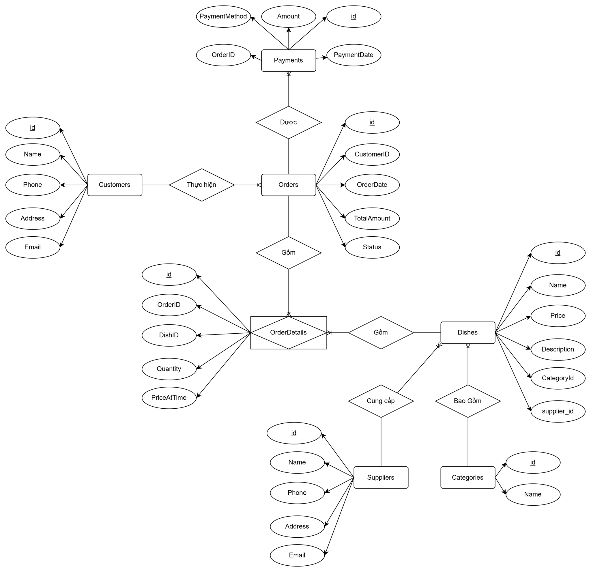
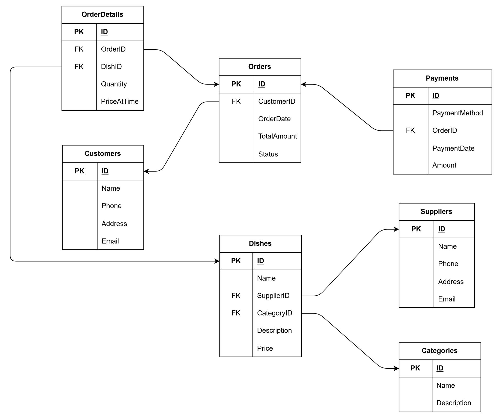

# Thiết kế cơ sở dữ liệu cho cửa hàng kinh doanh món ăn online

## Thông tin sinh viên

**Tên:** Lại Xuân Hiếu

**Mã sinh viên:** B22DCCN309

**Lớp:** D22CQCN09-B

---

## Mục lục

1.  [Mô tả bài toán](#1-mô-tả-bài-toán)
2.  [Xác định yêu cầu nghiệp vụ](#2-xác-định-yêu-cầu-nghiệp-vụ)
    1.  [Quản lý khách hàng](#21-quản-lý-khách-hàng)
    2.  [Quản lý món ăn](#22-quản-lý-món-ăn)
    3.  [Quản lý đơn hàng](#23-quản-lý-đơn-hàng)
    4.  [Quản lý thanh toán](#24-quản-lý-thanh-toán)
    5.  [Quản lý nhà cung cấp](#25-quản-lý-nhà-cung-cấp)
3.  [Xây dựng lược đồ thực thể liên kết](#3-xây-dựng-lược-đồ-thực-thể-liên-kết)
    1.  [Các thực thể chính](#31-các-thực-thể-chính)
    2.  [Các mối quan hệ](#32-các-mối-quan-hệ)
    3.  [Sơ đồ thực thể liên kết](#33-sơ-đồ-thực-thể-liên-kết)
4.  [Xây dựng lược đồ quan hệ](#4-xây-dựng-lược-đồ-quan-hệ)
    1.  [Chuyển đổi từ ERD sang Schema](#41-chuyển-đổi-từ-erd-sang-schema)
    2.  [Các ràng buộc toàn vẹn](#42-các-ràng-buộc-toàn-vẹn)
    3.  [Sơ đồ quan hệ](#43-sơ-đồ-quan-hệ)
5.  [Chuẩn hóa cơ sở dữ liệu](#5-chuẩn-hóa-cơ-sở-dữ-liệu)
    1.  [Dạng chuẩn 1 (1NF)](#51-dạng-chuẩn-1-1nf)
    2.  [Dạng chuẩn 2 (2NF)](#52-dạng-chuẩn-2-2nf)
    3.  [Dạng chuẩn 3 (3NF)](#53-dạng-chuẩn-3-3nf)
    4.  [Kết quả chuẩn hóa](#54-kết-quả-chuẩn-hóa)
6.  [Cài đặt cơ sở dữ liệu trên SQL Server](#6-cài-đặt-cơ-sở-dữ-liệu-trên-sql-server)
    1.  [Tạo cơ sở dữ liệu](#61-tạo-cơ-sở-dữ-liệu)
    2.  [Tạo các bảng](#62-tạo-các-bảng)
7.  [Các Hàm và thủ tục](#7-các-hàm-và-thủ-tục)
    1.  [Hàm tính tổng doanh thu cho một món ăn cụ thể (CalculateDishRevenue)](#71-hàm-tính-tổng-doanh-thu-cho-một-món-ăn-cụ-thể-calculatedishrevenue)
    2.  [Hàm lấy số lượng đơn hàng của một khách hàng (GetCustomerOrderCount)](#72-hàm-lấy-số-lượng-đơn-hàng-của-một-khách-hàng-getcustomerordercount)
    3.  [Hàm lấy giá trị trung bình của đơn hàng (GetAverageOrderValue)](#73-hàm-lấy-giá-trị-trung-bình-của-đơn-hàng-getaverageordervalue)
    4.  [Hàm lấy món ăn phổ biến nhất (GetMostPopularDish)](#74-hàm-lấy-món-ăn-phổ-biến-nhất-getmostpopulardish)
    5.  [Hàm tính tổng doanh thu cho một danh mục (CalculateCategoryRevenue)](#75-hàm-tính-tổng-doanh-thu-cho-một-danh-mục-calculatecategoryrevenue)
    6.  [Thủ tục tạo đơn hàng (CreateOrder)](#76-thủ-tục-tạo-đơn-hàng-createorder)
    7.  [Thủ tục thêm món ăn vào đơn hàng (AddDishToOrder)](#77-thủ-tục-thêm-món-ăn-vào-đơn-hàng-adddishtoorder)
    8.  [Thủ tục thanh toán đơn hàng (ProcessPayment)](#78-thủ-tục-thanh-toán-đơn-hàng-processpayment)
8.  [Các truy vấn và kết quả](#8-các-truy-vấn-và-kết-quả)
    1.  [Kịch bản sử dụng](#81-kịch-bản-sử-dụng)
    2.  [Lấy tất cả khách hàng](#82-lấy-tất-cả-khách-hàng)
    3.  [Lấy tất cả món ăn trong danh mục 'Món chính'](#83-lấy-tất-cả-món-ăn-trong-danh-mục-món-chính)
    4.  [Lấy tất cả đơn hàng được đặt bởi khách hàng 'Nguyễn Văn An'](#84-lấy-tất-cả-đơn-hàng-được-đặt-bởi-khách-hàng-nguyễn-văn-an)
    5.  [Tính tổng doanh thu cho 'Phở bò'](#85-tính-tổng-doanh-thu-cho-phở-bò)
    6.  [Lấy số lượng đơn hàng của khách hàng 'Trần Thị Bình'](#86-lấy-số-lượng-đơn-hàng-của-khách-hàng-trần-thị-bình)
    7.  [Lấy giá trị trung bình của đơn hàng](#87-lấy-giá-trị-trung-bình-của-đơn-hàng)
    8.  [Lấy món ăn phổ biến nhất](#88-lấy-món-ăn-phổ-biến-nhất)
    9.  [Tính tổng doanh thu cho danh mục 'Món chính'](#89-tính-tổng-doanh-thu-cho-danh-mục-món-chính)

---

## 1. Mô tả bài toán

Cửa hàng kinh doanh món ăn online cần một hệ thống cơ sở dữ liệu để quản lý hoạt động kinh doanh. Hệ thống này cần đảm bảo việc lưu trữ và quản lý thông tin về khách hàng, món ăn, đơn hàng, thanh toán và nhà cung cấp một cách hiệu quả và có tổ chức.

## 2. Xác định yêu cầu nghiệp vụ

### 2.1. Quản lý khách hàng

- Lưu trữ thông tin cá nhân của khách hàng
- Theo dõi lịch sử đặt hàng
- Hỗ trợ gửi thông báo và khuyến mãi

### 2.2. Quản lý món ăn

- Phân loại món ăn theo danh mục
- Quản lý giá cả và mô tả chi tiết
- Liên kết với nhà cung cấp

### 2.3. Quản lý đơn hàng

- Theo dõi trạng thái đơn hàng
- Lưu trữ chi tiết từng món trong đơn
- Tính toán tổng giá trị đơn hàng

### 2.4. Quản lý thanh toán

- Hỗ trợ nhiều phương thức thanh toán
- Theo dõi lịch sử giao dịch
- Xác nhận trạng thái thanh toán

### 2.5. Quản lý nhà cung cấp

- Lưu trữ thông tin liên hệ
- Theo dõi nguồn cung ứng món ăn
- Quản lý mối quan hệ với nhà cung cấp

## 3. Xây dựng lược đồ thực thể liên kết

### 3.1. Các thực thể chính

#### Khách hàng (Customers)

- CustomerID (PK)
- Name
- Phone
- Address
- Email

#### Món ăn (Dishes)

- DishID (PK)
- Name
- Price
- Description
- CategoryID (FK)
- SupplierID (FK)

#### Đơn hàng (Orders)

- OrderID (PK)
- CustomerID (FK)
- OrderDate
- TotalAmount
- Status

#### Nhà cung cấp (Suppliers)

- SupplierID (PK)
- Name
- Phone
- Address
- Email

#### Danh mục món ăn (Categories)

- CategoryID (PK)
- Name
- Description

#### Thanh toán (Payments)

- PaymentID (PK)
- OrderID (FK)
- PaymentDate
- Amount
- Method

### 3.2. Các mối quan hệ

- Khách hàng (1) --- (n) Đơn hàng
- Đơn hàng (1) --- (n) Chi tiết đơn hàng
- Món ăn (n) --- (1) Danh mục món ăn
- Món ăn (n) --- (1) Nhà cung cấp
- Đơn hàng (1) --- (n) Thanh toán

### 3.3. Sơ đồ thực thể liên kết



## 4. Xây dựng lược đồ quan hệ

### 4.1. Chuyển đổi từ ERD sang Schema

Customers(**CustomerID**, Name, Phone, Address, Email)
Dishes(**DishID**, Name, Price, Description, _CategoryID_, _SupplierID_)
Orders(**OrderID**, _CustomerID_, OrderDate, TotalAmount, Status)
OrderDetails(**OrderDetailID**, _OrderID_, _DishID_, Quantity, PriceAtTime)
Suppliers(**SupplierID**, Name, Phone, Address, Email)
Categories(**CategoryID**, Name, Description)
Payments(**PaymentID**, _OrderID_, PaymentDate, Amount, Method)

### 4.2. Các ràng buộc toàn vẹn

- Khóa ngoại CustomerID trong Orders tham chiếu đến CustomerID trong Customers
- Khóa ngoại CategoryID trong Dishes tham chiếu đến CategoryID trong Categories
- Khóa ngoại SupplierID trong Dishes tham chiếu đến SupplierID trong Suppliers
- Khóa ngoại OrderID trong OrderDetails tham chiếu đến OrderID trong Orders
- Khóa ngoại DishID trong OrderDetails tham chiếu đến DishID trong Dishes
- Khóa ngoại OrderID trong Payments tham chiếu đến OrderID trong Orders

### 4.3. Sơ đồ quan hệ



## 5. Chuẩn hóa cơ sở dữ liệu

### 5.1. Dạng chuẩn 1 (1NF)

Các bảng trong CSDL đã đạt 1NF do:

- Mỗi thuộc tính đều nguyên tố
- Các giá trị trong cột đều đơn trị
- Không tồn tại nhóm lặp

### 5.2. Dạng chuẩn 2 (2NF)

Các bảng đã đạt 2NF vì:

- Đã đạt 1NF
- Không có phụ thuộc chức năng trên một phần của khóa chính

### 5.3. Dạng chuẩn 3 (3NF)

Các bảng đã đạt 3NF do:

- Đã đạt 2NF
- Không có phụ thuộc bắc cầu giữa các trường không khóa

### 5.4. Kết quả chuẩn hóa

Sau quá trình chuẩn hóa, CSDL đã:

- Loại bỏ được dư thừa dữ liệu
- Đảm bảo tính nhất quán khi cập nhật
- Dễ dàng bảo trì và mở rộng
- Tránh các anomaly trong quá trình cập nhật

Cấu trúc các bảng sau chuẩn hóa:

1. **Customers** (_CustomerID_, Name, Phone, Address, Email)
2. **Categories** (_CategoryID_, Name, Description)
3. **Suppliers** (_SupplierID_, Name, Phone, Address, Email)
4. **Dishes** (_DishID_, Name, Price, Description, CategoryID, SupplierID)
5. **Orders** (_OrderID_, CustomerID, OrderDate, TotalAmount, Status)
6. **OrderDetails** (_OrderDetailID_, OrderID, DishID, Quantity, PriceAtTime)
7. **Payments** (_PaymentID_, OrderID, PaymentMethod, PaymentDate, Amount)

## 6. Cài đặt cơ sở dữ liệu trên SQL Server

### 6.1. Tạo cơ sở dữ liệu

```sql
CREATE DATABASE online_food_ordering;
USE online_food_ordering;
```

### 6.2. Tạo các bảng

#### 6.2.1. Bảng Khách hàng

```sql
CREATE TABLE [customers] (
    id INT PRIMARY KEY IDENTITY(1, 1),
    name NVARCHAR(50),
    phone VARCHAR(10),
    address NVARCHAR(100),
    email VARCHAR(100)
);
```

#### 6.2.2. Bảng Danh mục

```sql
CREATE TABLE [categories] (
    id INT PRIMARY KEY IDENTITY(1, 1),
    name NVARCHAR(50),
    description NVARCHAR(200)
);
```

#### 6.2.3. Bảng Nhà cung cấp

```sql
CREATE TABLE [suppliers] (
    id INT PRIMARY KEY IDENTITY(1, 1),
    name NVARCHAR(50),
    phone VARCHAR(10),
    address NVARCHAR(100),
    email VARCHAR(100)
);
```

#### 6.2.4. Bảng Món ăn

```sql
CREATE TABLE [dishes] (
    id INT PRIMARY KEY IDENTITY(1, 1),
    name NVARCHAR(30),
    price DECIMAL(10, 2),
    description NVARCHAR(200),
    category_id INT REFERENCES [categories](id) ON DELETE CASCADE,
    supplier_id INT REFERENCES [suppliers](id) ON DELETE CASCADE
);
```

#### 6.2.5. Bảng Đơn hàng

```sql
CREATE TABLE [orders] (
    id INT PRIMARY KEY IDENTITY(1, 1),
    customer_id INT REFERENCES [customers](id),
    order_date DATE,
    total_amount INT,
    status NVARCHAR(30)
);
```

#### 6.2.6. Bảng Chi tiết đơn hàng

```sql
CREATE TABLE [order_details] (
    id INT PRIMARY KEY IDENTITY(1, 1),
    order_id INT REFERENCES [orders](id),
    dish_id INT REFERENCES [dishes](id),
    quantity INT,
    price_at_time INT
);
```

#### 6.2.7. Bảng Thanh toán

```sql
CREATE TABLE [payments] (
    id INT PRIMARY KEY IDENTITY(1, 1),
    order_id INT REFERENCES [orders](id),
    payment_method NVARCHAR(20),
    payment_date DATE,
    amount INT
);
```

## 7. Các Hàm và thủ tục

### 7.1. Hàm tính tổng doanh thu cho một món ăn cụ thể (CalculateDishRevenue)

```sql
CREATE FUNCTION CalculateDishRevenue (@dish_id INT)
RETURNS DECIMAL(10, 2)
AS
BEGIN
    DECLARE @total_revenue DECIMAL(10, 2);

    SELECT @total_revenue = SUM(od.quantity * od.price_at_time)
    FROM order_details od
    WHERE od.dish_id = @dish_id;

    RETURN ISNULL(@total_revenue, 0);
END
GO
```

### 7.2. Hàm lấy số lượng đơn hàng của một khách hàng (GetCustomerOrderCount)

```sql
CREATE FUNCTION GetCustomerOrderCount (@customer_id INT)
RETURNS INT
AS
BEGIN
    DECLARE @order_count INT;

    SELECT @order_count = COUNT(*)
    FROM orders
    WHERE customer_id = @customer_id;

    RETURN ISNULL(@order_count, 0);
END
GO
```

### 7.3. Hàm lấy giá trị trung bình của đơn hàng (GetAverageOrderValue)

```sql
CREATE FUNCTION GetAverageOrderValue ()
RETURNS DECIMAL(10, 2)
AS
BEGIN
    DECLARE @avg_order_value DECIMAL(10, 2);

    SELECT @avg_order_value = AVG(total_amount)
    FROM orders;

    RETURN ISNULL(@avg_order_value, 0);
END
GO
```

### 7.4. Hàm lấy món ăn phổ biến nhất (GetMostPopularDish)

```sql
CREATE FUNCTION GetMostPopularDish ()
RETURNS NVARCHAR(30)
AS
BEGIN
    DECLARE @most_popular_dish NVARCHAR(30);

    SELECT TOP 1 @most_popular_dish = d.name
    FROM order_details od
    JOIN dishes d ON od.dish_id = d.id
    GROUP BY d.name
    ORDER BY SUM(od.quantity) DESC;

    RETURN ISNULL(@most_popular_dish, N'Không có món ăn');
END
GO
```

### 7.5. Hàm tính tổng doanh thu cho một danh mục (CalculateCategoryRevenue)

```sql
CREATE FUNCTION CalculateCategoryRevenue (@category_id INT)
RETURNS DECIMAL(10, 2)
AS
BEGIN
    DECLARE @total_revenue DECIMAL(10, 2);

    SELECT @total_revenue = SUM(od.quantity * od.price_at_time)
    FROM order_details od
    JOIN dishes d ON od.dish_id = d.id
	WHERE d.category_id = @category_id;

    RETURN ISNULL(@total_revenue, 0);
END
GO
```

### 7.6. Thủ tục tạo đơn hàng (CreateOrder)

```sql
CREATE PROCEDURE CreateOrder (
    @customer_id INT,
    @status NVARCHAR(30) OUTPUT,
    @order_id INT OUTPUT
)
AS
BEGIN
    -- Check if customer exists
    IF NOT EXISTS (SELECT 1 FROM customers WHERE id = @customer_id)
    BEGIN
        RAISERROR('Invalid customer ID.', 16, 1)
        RETURN
    END

    INSERT INTO orders (customer_id, order_date, total_amount, status)
    VALUES (@customer_id, GETDATE(), 0, N'Đang xử lý');

    SET @order_id = SCOPE_IDENTITY();
    SET @status = N'Đang xử lý';
END
GO
```

### 7.7. Thủ tục thêm món ăn vào đơn hàng (AddDishToOrder)

```sql
CREATE PROCEDURE AddDishToOrder (
    @order_id INT,
    @dish_id INT,
    @quantity INT
)
AS
BEGIN
    -- Kiểm tra nếu đơn hàng và món ăn tồn tại
    IF NOT EXISTS (SELECT 1 FROM orders WHERE id = @order_id)
    BEGIN
        RAISERROR('Invalid order ID.', 16, 1)
        RETURN
    END

    IF NOT EXISTS (SELECT 1 FROM dishes WHERE id = @dish_id)
    BEGIN
        RAISERROR('Invalid dish ID.', 16, 1)
        RETURN
    END

    -- Lấy Giá Món Ăn
    DECLARE @price DECIMAL(10, 2);
    SELECT @price = price FROM dishes WHERE id = @dish_id;

    -- Thêm vào bảng order_details
    INSERT INTO order_details (order_id, dish_id, quantity, price_at_time)
    VALUES (@order_id, @dish_id, @quantity, @price);

    -- Tính tổng tiền
    DECLARE @total_amount DECIMAL (10,2);
    SELECT @total_amount = SUM(quantity * price_at_time)
    FROM order_details 
    WHERE order_id = @order_id;

    -- Cập nhật tổng tiền vào bảng orders
    UPDATE orders
    SET total_amount = @total_amount
    WHERE id = @order_id;
END
GO
```

### 7.8. Thủ tục thanh toán đơn hàng (ProcessPayment)

```sql
CREATE PROCEDURE ProcessPayment (
    @order_id INT,
    @payment_method NVARCHAR(20)
)
AS
BEGIN
    -- Kiểm tra nếu đơn hàng tồn tại
    IF NOT EXISTS (SELECT 1 FROM orders WHERE id = @order_id)
    BEGIN
        RAISERROR('Invalid order ID.', 16, 1)
        RETURN
    END

    -- Lấy tổng tiền của đơn hàng
    DECLARE @total_amount DECIMAL (10,2);
    SELECT @total_amount = total_amount 
    FROM orders 
    WHERE id = @order_id;

    -- Thêm thông tin thanh toán vào bảng payments
    INSERT INTO payments (order_id, payment_method, payment_date, amount)
    VALUES (@order_id, @payment_method, GETDATE(), @total_amount);

    -- Cập nhật trạng thái đơn hàng
    UPDATE orders
    SET status = N'Đã thanh toán'
    WHERE id = @order_id;
END
GO
```

## 8. Các truy vấn và kết quả

### 8.1. Kịch bản sử dụng

```sql
-- Khai báo biến
DECLARE @order_id INT, @order_status NVARCHAR(30);

-- Tạo đơn hàng
EXEC CreateOrder @customer_id = 1,
                 @status = @order_status OUTPUT,
                 @order_id = @order_id OUTPUT;

-- Thêm món ăn vào đơn hàng
EXEC AddDishToOrder @order_id = @order_id,
                    @dish_id = 2,
                    @quantity = 1;

EXEC [AddDishToOrder] @order_id = @order_id,
                      @dish_id = 3, 
                      @quantity = 2;
-- Thanh toán đơn hàng
EXEC ProcessPayment @order_id = @order_id,
                    @payment_method = N'Tiền mặt';

-- Xem chi tiết đơn hàng
SELECT [dishes].name, quantity, price_at_time
FROM [order_details]
JOIN [dishes]
ON [dishes].id = [order_details].dish_id
WHERE order_id = @order_id;

-- Xem thông tin đơn hàng
SELECT * FROM [order_details] WHERE order_id = @order_id;
SELECT [orders].customer_id, name, order_date, total_amount, orders.status
FROM [orders]
JOIN [customers]
ON [customers].id = [orders].customer_id
WHERE orders.id = @order_id;
```

**Kết quả:**

| name          | quantity | price_at_time |
|---------------|----------|---------------|
| Bún chả       | 1        | 45000         |
| Nem rán       | 2        | 40000         |


| customer_id | name          | order_date | total_amount | status     |
|-------------|---------------|------------|--------------|------------|
| 1           | Nguyễn Văn An | 2025-02-24 | 12500        | Đã thanh toán |

### 8.2. Lấy tất cả khách hàng

**Truy vấn:**

```sql
SELECT * FROM customers;
```

**Kết quả:**
| id | name           | phone      | address                   | email                |
|----|----------------|------------|---------------------------|----------------------|
| 1  | Nguyễn Văn An  | 0987654321 | 123 Đường Láng, Hà Nội    | an.nguyen@email.com  |
| 2  | Trần Thị Bình  | 0912345678 | 456 Phố Huế, Hà Nội       | binh.tran@email.com  |
| 3  | Lê Văn Cường   | 0903112233 | 789 Giải Phóng, Hà Nội    | cuong.le@email.com   |
| 4  | Phạm Thị Dung  | 0966554433 | 101 Xuân Thủy, Hà Nội     | dung.pham@email.com  |
| 5  | Hoàng Văn Em   | 0977889900 | 112 Cầu Giấy, Hà Nội      | em.hoang@email.com   |
| 6  | Đỗ Thị Gấm     | 0933221144 | 131 Nguyễn Trãi, Hà Nội   | gam.do@email.com     |
| 7  | Vũ Văn Hà      | 0922446688 | 143 Kim Mã, Hà Nội        | ha.vu@email.com      |
| 8  | Phan Thị Hương | 0944668800 | 155 Bà Triệu, Hà Nội      | huong.phan@email.com |
| 9  | Bùi Văn Ích    | 0955880022 | 167 Trần Phú, Hà Nội      | ich.bui@email.com    |
| 10 | Ngô Thị Khuyên | 0999002244 | 179 Lạc Long Quân, Hà Nội | khuyen.ngo@email.com |

### 8.3. Lấy tất cả món ăn trong danh mục 'Món chính'

**Truy vấn:**

```sql
SELECT *
FROM dishes
WHERE category_id = (SELECT id FROM categories WHERE name = N'Món chính');
```

**Kết quả:**
| id | name               | price     | description                | category_id | supplier_id |
|----|--------------------|-----------|----------------------------|-------------|-------------|
| 1  | Phở bò             | 50000.00  | Phở bò truyền thống Hà Nội | 1           | 1           |
| 2  | Bún chả            | 45000.00  | Bún chả Hà Nội             | 1           | 4           |
| 5  | Lẩu gà             | 300000.00 | Lẩu gà lá giang            | 1           | 4           |
| 6  | Cơm rang dưa bò    | 60000.00  | Cơm rang dưa bò            | 1           | 1           |
| 7  | Mỳ ý sốt bò băm    | 70000.00  | Mỳ ý sốt bò băm            | 1           | 4           |
| 8  | Bún riêu cua       | 55000.00  | Bún riêu cua đồng          | 1           | 3           |
| 11 | Canh măng nấu vịt  | 45000.00  | Canh măng nấu vịt          | 1           | 4           |
| 12 | Sườn xào chua ngọt | 65000.00  | Sườn xào chua ngọt         | 1           | 4           |
| 13 | Gà nướng mật ong   | 80000.00  | Gà nướng mật ong           | 1           | 4           |
| 15 | Rau muống xào tỏi  | 30000.00  | Rau muống xào tỏi          | 1           | 2           |
| 19 | Súp gà ngô non     | 45000.00  | Súp gà ngô non             | 1           | 4           |

### 8.4. Lấy tất cả đơn hàng được đặt bởi khách hàng 'Nguyễn Văn An'

**Truy vấn:**

```sql
SELECT *
FROM orders
WHERE customer_id = (SELECT id FROM customers WHERE name = N'Nguyễn Văn An');
```

**Kết quả:**
| id | customer_id | order_date | total_amount | status     |
|----|-------------|------------|--------------|------------|
| 1  | 1           | 2025-02-24 | 50000        | Đang xử lý |
| 11 | 1           | 2025-02-24 | 70000        | Đang giao  |
| 21 | 1           | 2025-02-24 | 60000        | Đã giao    |

### 8.5. Tính tổng doanh thu cho 'Phở bò'

**Truy vấn:**

```sql
SELECT dbo.CalculateDishRevenue(
    (SELECT id FROM dishes WHERE name = N'Phở bò')) AS 'Total Revenue';
```

**Kết quả:**
| Total Revenue |
|---------------|
|   100000.00   |

### 8.6. Lấy số lượng đơn hàng của khách hàng 'Trần Thị Bình'

**Truy vấn:**

```sql
SELECT dbo.GetCustomerOrderCount(
    (SELECT id FROM customers WHERE name = N'Trần Thị Bình')) AS 'Order Count';
```

**Kết quả:**
| Order Count |
|-------------|
| 3           |

### 8.7. Lấy giá trị trung bình của đơn hàng

**Truy vấn:**

```sql
SELECT dbo.GetAverageOrderValue() AS 'Average Order Value';
```

**Kết quả:**
| Average Order Value |
|---------------------|
| 70000.00           |


### 8.8. Lấy món ăn phổ biến nhất

**Truy vấn:**

```sql
SELECT dbo.GetMostPopularDish() AS 'Most Popular Dish';
```

**Kết quả:**

| Most Popular Dish |
|-------------------|
| Bún chả           |


### 8.9. Tính tổng doanh thu cho danh mục 'Món chính'

**Truy vấn:**

```sql
SELECT dbo.CalculateCategoryRevenue(
    (SELECT id FROM categories WHERE name = N'Món chính')) AS 'Total Revenue';
```

**Kết quả:**
| Total Revenue |
|---------------|
|  2435000.00   |


